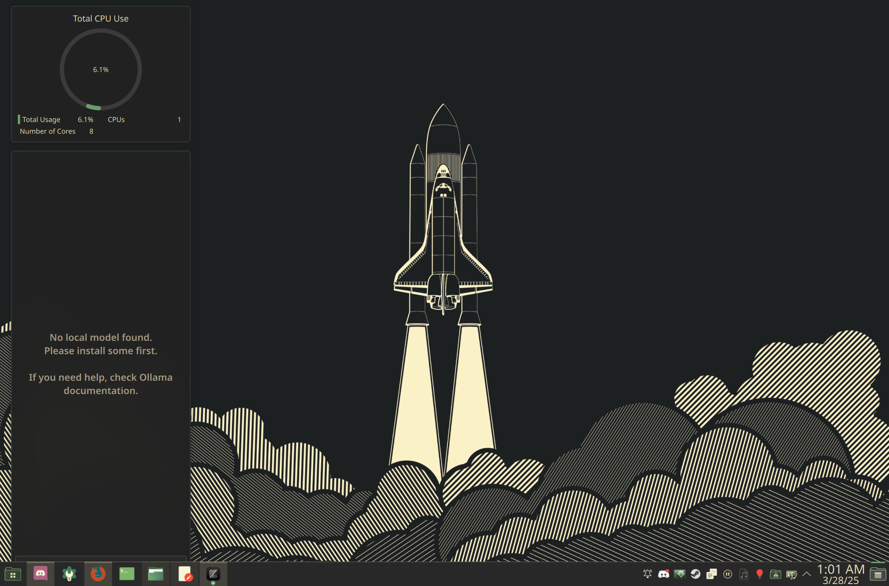
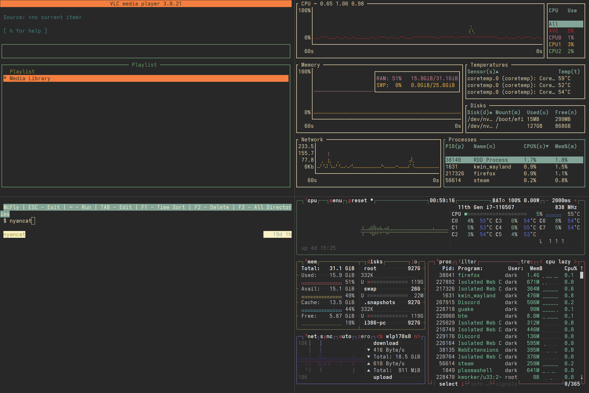
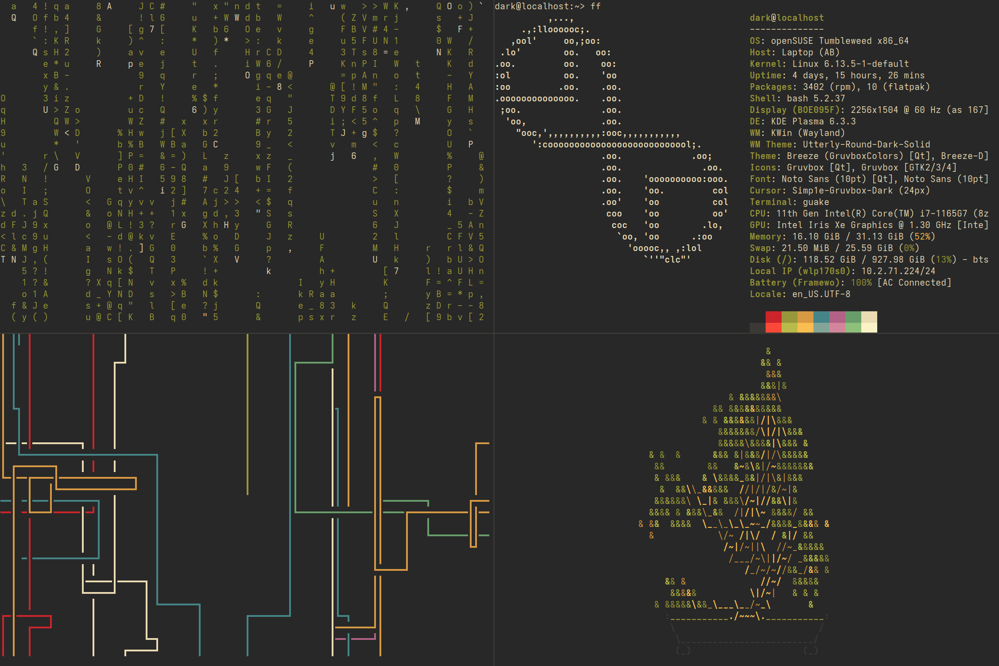
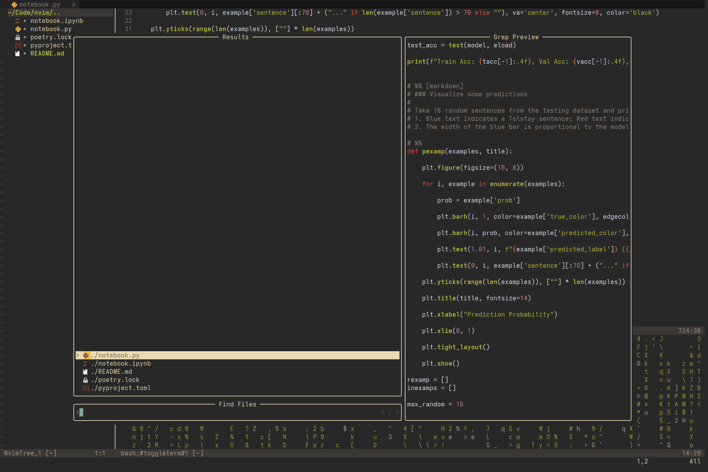

## Welcome to my dotfiles

These are my personal dotfiles, built for daily usage on OpenSUSE Tumbleweed with a focus on using KDE Plasma.

---

## System Setup

| Component       | Tool               |
|----------------|--------------------|
| OS             | OpenSUSE Tumbleweed |
| Shell          | Zsh + Zinit        |
| Editor         | Neovim, Zed        |
| Terminal       | Guake              |
| DE             | KDE Plasma         |
| Theme          | Gruvbox + Breeze   |

---

## Screenshots









---

### Getting the dotfiles


```bash
git clone https://github.com/KunjVPatel/dotfiles.git
```

---

## Credits

- Gruvbox Wallpapers: [gruvbox-wallpapers.pages.dev](https://gruvbox-wallpapers.pages.dev)
- Gruvbox Theme: [morhetz/gruvbox](https://github.com/morhetz/gruvbox)

---
